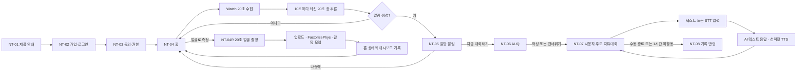

# NeuroTruth 앱 디자인·워크플로우 인계 v10

이 문서는 환자용 Android 앱을 구현·검수하는 프런트엔드 개발자를 위한 인계 자료다. 화면 디자인은 `docs/handoff/neurotruth_app_design_handoff_v10.pptx`, 상세 상태·버튼 반응·API 연결은 본 문서를 기준으로 한다.

## 1. 인계 범위와 현재 상태

### 포함

- 환자 가입·로그인·동의
- `홈 · 대시보드 · 챗봇` 3탭
- Watch PPG/GSR 20초 수집과 10초 간격 추론
- 갈망 알림과 선택형 AUQ
- 텍스트·STT 입력과 Android TTS
- 사용자 주도 자유대화
- 20초 얼굴 영상 rPPG 측정
- 갈망 단계 중첩 막대, 이벤트, AUQ 대시보드

### 제외

- 관리자 웹 상세 디자인
- Wear OS 상세 화면
- 서버 운영·키·암호화 설정 화면
- 모델의 정확한 class-1 확률 표시
- 치료 효과·진단·임상 위험도 표현

### 확인된 배포 상태 — 2026-07-18

- NeuroTruth backend가 DGX Spark에서 정상 기동한다.
- DB schema revision은 `20260717_0005`다.
- 20초 binary craving model은 `cuda:0`에서 준비 상태다.
- FactorizePhys rPPG API는 `model_loaded=true`, `cuda:0` 상태다.
- backend container에서 FactorizePhys health endpoint까지 연결된다.
- STT는 CPU fallback으로 동작할 수 있으며 이 장치 정보는 환자 UI에 노출하지 않는다.
- 자유대화 prompt는 `free-dialogue-v4-met-cbt-informed`다.
- backend 회귀 테스트는 `150 passed, 1 skipped`를 확인했다.

## 2. 제품 표현 원칙

- NeuroTruth는 갈망 상황에서 기록과 대화를 지원하는 연구용 보조 시스템이다.
- 사용자의 상태를 진단하거나 치료 결과를 약속하는 문구를 쓰지 않는다.
- 갈망 모델의 정확한 퍼센트는 환자 화면에서 숨기고 네 단계 문구로 표시한다.
- 알림은 갈망이 확정됐다는 뜻이 아니라 대화를 고려할 수 있다는 안내로 표현한다.
- AI 텍스트는 항상 표시하고 TTS는 사용자가 선택한다.
- rPPG는 Watch를 대체하는 확정 측정이 아니라 선택형 얼굴 영상 분석 기능이다.

## 3. 화면 이름

| ID | 화면 | 핵심 역할 |
| --- | --- | --- |
| `NT-01` | 제품 안내 | 사용 대상, 연구용 보조 시스템, 한계 안내 |
| `NT-02` | 가입·로그인 | 환자 직접 가입과 기존 계정 로그인 |
| `NT-03` | 동의·권한 | 필수·선택 동의와 사용 시점 권한 요청 |
| `NT-04` | 홈 | 프로필, 갈망 상태, Watch 상태, 설정, 얼굴 측정 진입 |
| `NT-04R` | 얼굴 측정 | 얼굴 찾기부터 20초 촬영·업로드·분석 결과까지 표시 |
| `NT-05` | 갈망 알림 | 스마트폰 팝업에서 지금 대화 또는 나중에 선택 |
| `NT-06` | AUQ | 8문항과 문장형 7점 선택지 |
| `NT-07` | AI 챗봇 | 텍스트·STT 입력, 사용자 주도 자유대화, TTS, 재시도, 종료 |
| `NT-08` | 대시보드 | 갈망 단계 구성, 이벤트, AUQ 기록 탐색 |
| `NT-09` | 설정 | 계정, 동의, 권한, 제품 안내, 로그아웃 |

## 4. 전체 사용자 흐름



## 5. 하단 내비게이션

| 탭 | 선택 시 반응 |
| --- | --- |
| 홈 | `NT-04`를 열고 최신 Watch·갈망·rPPG 상태를 표시한다. |
| 대시보드 | `NT-08` 집계 데이터를 불러오고 선택 기간을 유지한다. |
| 챗봇 | 진행 중 session이 있으면 재개하고 없으면 새 자유대화를 연다. |

- 얼굴 측정 또는 전체화면 AUQ가 열려 있을 때는 하단 탭을 숨길 수 있다.
- 설정은 하단 탭이 아니라 홈 우측 상단 버튼으로 연다.
- 프로필은 별도 탭을 만들지 않는다.

## 6. 홈 — `NT-04`

홈의 첫 화면은 다음 세 영역만 우선 보여 준다.

### 프로필

- 사용자 이름과 최소 기본 정보
- 우측 상단 설정 버튼
- 설정 버튼 선택 시 `NT-09`

### 갈망 상태

- 최신 상태 문구
- 연구용 모델 출력 안내
- 알림이 생성된 경우 별도의 `대화 권장` 상태
- 조건 충족 시 `얼굴로 측정` 보조 버튼

### Watch

- `연결 대기`, `연결됨`, `20초 수집 중`, `10초 간격 분석 중`
- 홈에는 실시간 PPG 파형을 표시하지 않는다.

### 갈망 상태 문구

| class-1 확률 | 환자 표시 |
| --- | --- |
| `0 ≤ p < 0.25` | 낮은 가능성 |
| `0.25 ≤ p < 0.50` | 변화 관찰 |
| `0.50 ≤ p < 0.75` | 주의 필요 |
| `0.75 ≤ p ≤ 1.00` | 높은 가능성 |

이 범위는 연구 UI 표시 규칙이며 임상적 cutoff가 아니다.

## 7. `얼굴로 측정` 버튼 표시 조건

버튼 위치:

```text
홈
└─ 갈망 상태 카드
   └─ 얼굴로 측정
```

프런트엔드는 다음 두 조건을 모두 만족할 때만 버튼을 표시한다.

### 사용자 동의 조건

```text
로그인됨
AND 생체신호 수집 동의
AND AI 분석 동의
AND 카메라 rPPG 분석 동의
AND 얼굴 영상 영구 보존 동의
```

Android 기준 상태는 `MobileAuthState.canCaptureRppg`다.

### 서버 준비 조건

`GET /api/rppg/status` 결과가 다음을 만족해야 한다.

```text
enabled = true
available = true
modelLoaded = true
```

Android 기준 상태는 `RppgServiceStatus.canStart`다.

### 상태 갱신

- 로그인 직후 rPPG status를 조회한다.
- 동의 스냅샷 저장 후 동의 상태를 다시 반영한다.
- 서버 flag를 켠 직후 앱이 실행 중이었다면 앱 재시작 또는 로그인 재개 시 status를 갱신한다.
- 준비되지 않은 기능을 빈 버튼으로 남기지 않는다.

## 8. 얼굴 영상 rPPG — `NT-04R`

```text
얼굴 찾기
→ 한 얼굴 1초 안정화
→ 20초 촬영
→ 업로드
→ 분석 대기
→ 완료 / 재촬영 필요 / 실패
```

### 화면 상태

| 상태 | 화면 문구·동작 |
| --- | --- |
| 얼굴 찾기 | 중앙 가이드와 얼굴 맞춤 안내 |
| 안정화 | 1초 진행 상태 표시 |
| 촬영 | 20초 진행 표시, 화면 이탈 시 취소 |
| 업로드 | 중복 탭 차단, 진행 상태 표시 |
| 분석 대기 | 앱을 다시 열어도 job polling 재개 |
| 완료 | 심박·품질과 갈망 단계 문구 표시 |
| 재촬영 필요 | 품질 부족 안내와 새 촬영 버튼 |
| 실패 | 재분석 가능 오류와 새 촬영 필요 오류를 구분 |

- 촬영 중 얼굴이 1초 이상 사라지거나 앱이 background로 이동하면 취소한다.
- HTTP 202 접수 후 휴대폰 임시 MP4를 삭제한다.
- 카메라 prediction은 휴대폰 홈·대시보드·알림 흐름에 반영하지만 Watch로 보내지 않는다.
- 앱은 FactorizePhys `8000` 포트를 직접 호출하지 않는다. 항상 인증된 NeuroTruth backend를 호출한다.

### rPPG API

| 동작 | API |
| --- | --- |
| 기능 상태 | `GET /api/rppg/status` |
| 영상 접수 | `POST /api/rppg/jobs` |
| 분석 상태 | `GET /api/rppg/jobs/{jobId}` |
| 허용된 수동 재분석 | `POST /api/rppg/jobs/{jobId}/retry` |

## 9. Watch 센서 흐름

```text
Watch 연결
→ 첫 20초 warm-up
→ 최근 PPG/GSR 20초 창 구성
→ 10초마다 최신 20초 창 업로드
→ backend 1,024점/채널 전처리·추론
→ class·확률·alertAction 수신
→ 홈·알림·대시보드 갱신
```

프런트엔드 계약:

- `windowMs = 20000`
- 첫 결과 전 20초 수집 상태를 표시한다.
- 이후 10초마다 최신 20초 창을 보낸다.
- 데이터가 끊긴 구간을 추정값으로 채우지 않는다.
- 알림은 server `alertAction`을 따른다.

## 10. 갈망 알림과 AUQ

### 알림 — `NT-05`

- 스마트폰 팝업으로 표시한다.
- 기본 행동: `지금 대화하기`
- 보조 행동: `나중에`
- `나중에`는 팝업만 닫고 현재 화면을 유지한다.
- 확정 판정처럼 보이는 문구를 쓰지 않는다.

### AUQ — `NT-06`

각 문항의 선택지는 다음 문장으로 고정한다.

1. 매우 그렇지 않다
2. 그렇지 않다
3. 조금 그렇지 않다
4. 보통이다
5. 조금 그렇다
6. 그렇다
7. 매우 그렇다

- 현재 8문항을 유지한다.
- `건너뛰고 대화하기`를 제공한다.
- 총점은 `8~56` 원점수다.
- 상세는 `총점 X/56`으로 표시한다.
- 임의의 낮음·중간·높음 cutoff를 추가하지 않는다.

## 11. 사용자 주도 자유대화 — `NT-07`

대화 prompt는 `free-dialogue-v4-met-cbt-informed`다. 프런트엔드는 내부 prompt 명칭을 노출하지 않고 다음 경험을 제공한다.

- 사용자가 말하고 싶은 상황이나 원하는 도움을 자유롭게 입력한다.
- AI는 공감과 정확한 반영을 우선한다.
- 질문은 필요할 때만 한 응답에 최대 하나다.
- 이미 답했거나 거부한 질문을 반복하지 않는다.
- 조언이나 대처 방법은 사용자가 요청하거나 동의했을 때 한 가지만 제안한다.
- 설득·논쟁·훈계·낙인과 재음주를 실패로 단정하는 표현을 쓰지 않는다.
- 진단·처방·치료 효과·즉시 감소·확정 인과 표현을 쓰지 않는다.

### 텍스트·STT 입력

1. 키보드 입력은 항상 가능하다.
2. 마이크를 탭하면 녹음을 시작하고 다시 탭하면 종료한다.
3. 녹음은 최대 30초다.
4. STT 결과는 편집 가능한 입력창에 채운다.
5. 자동 전송하지 않는다.
6. 사용자가 확인하고 전송한 최종 텍스트만 대화 메시지가 된다.
7. STT 실패 시 텍스트 입력을 유지한다.

### AI 텍스트·TTS

- AI 텍스트는 항상 말풍선에 표시한다.
- 말풍선별 `듣기/정지`를 제공한다.
- 자동 읽기는 기본 OFF다.
- 다른 응답을 재생하거나 화면을 벗어나면 기존 재생을 중지한다.
- TTS 실패가 텍스트 대화를 막지 않는다.

### 전송 실패와 재시도

- provider 실패 시 사용자 말풍선을 중복 생성하지 않는다.
- 같은 `clientMessageId`로 `응답 다시 받기`를 제공한다.
- 재시도 가능 횟수가 소진되면 새 자동 재시도를 하지 않는다.
- 대화는 수동 종료 또는 1시간 inactivity timeout으로 마감한다.

### 챗봇 API

| 동작 | API·계약 |
| --- | --- |
| STT 상태 | `GET /api/stt/status` |
| 한국어 STT | `POST /api/sessions/{sessionId}/transcriptions` |
| 메시지 | `POST /api/sessions/{sessionId}/messages` |
| 입력 방식 | `inputModality = text | voice` |
| 종료 | `POST /api/sessions/{sessionId}/finish` |

## 12. 대시보드 — `NT-08`

대시보드는 삼성헬스 일일 활동 화면처럼 큰 요약, 날짜 선택, 그래프, 선택 상세 순서로 세로 스크롤한다.

### 갈망 단계 중첩 막대

- 오늘은 24개 시간 막대를 사용한다.
- 각 시간 막대는 `낮은 가능성 · 변화 관찰 · 주의 필요 · 높은 가능성` 표본 비율을 100% 중첩한다.
- 단계 색상과 텍스트 라벨을 함께 제공한다.
- 막대 선택 시 시간, 단계별 비율, 표본 수를 표시한다.
- 표본이 없으면 회색 빈 구간으로 표시한다.
- 정확한 평균 확률 숫자는 환자 화면에 표시하지 않는다.

### 갈망 이벤트

- 실제 생성된 `recommend|required` 알림을 이벤트로 센다.
- 7일·30일 일별 건수를 막대로 표시한다.
- prediction 데이터가 없는 날은 `데이터 없음`이다.
- prediction은 있지만 이벤트가 없는 날은 `0건`이다.

### AUQ

- 오늘은 시간별, 7일·30일은 일별로 표시한다.
- 축 최대값은 56이다.
- 0~100% normalization을 사용하지 않는다.
- 선택 상세는 `총점 X/56`과 응답 횟수를 표시한다.

## 13. 주요 버튼 반응

| 화면 | 누르는 항목 | 앱 반응 | 목적지 |
| --- | --- | --- | --- |
| `NT-01` | 확인하고 계속 | 안내 확인 버전 저장 | `NT-02` |
| `NT-02` | 가입하고 시작 | 계정 생성 후 동의 확인 | `NT-03` 또는 `NT-04` |
| `NT-03` | 새 동의 스냅샷 저장 | 동의 상태 저장·반영 | `NT-04` |
| `NT-04` | 설정 | 계정·동의·권한 표시 | `NT-09` |
| `NT-04` | 얼굴로 측정 | 조건 확인 후 카메라 준비 | `NT-04R` |
| `NT-04R` | 촬영 취소 | 임시 영상 삭제·상태 복원 | `NT-04` |
| `NT-04R` | 재촬영 | 새 capture ID로 촬영 재개 | `NT-04R` |
| `NT-05` | 지금 대화하기 | 대화 진입 상태 저장 | `NT-06` |
| `NT-05` | 나중에 | 팝업 닫기 | 현재 화면 |
| `NT-06` | 다음 | 값 저장 후 다음 문항 | `NT-06` |
| `NT-06` | 건너뛰기·완료 | AUQ 상태 저장 후 대화 시작 | `NT-07` |
| `NT-07` | 마이크 | 녹음 시작·정지와 STT | `NT-07` |
| `NT-07` | 전송 | 최종 문장 저장 후 AI 응답 요청 | `NT-07` |
| `NT-07` | 응답 다시 받기 | 같은 메시지 ID로 한 번 재시도 | `NT-07` |
| `NT-07` | 듣기·정지 | Android TTS 상태 변경 | `NT-07` |
| `NT-07` | 종료 | session 종료·기록 반영 | `NT-08` |
| `NT-08` | 중첩 막대 | 단계 비율과 표본 상세 표시 | `NT-08` |

## 14. 프런트엔드 오류 상태

| 상황 | 사용자 처리 |
| --- | --- |
| 인증 만료 | 로그인 화면으로 이동하고 진행 중 로컬 입력을 가능한 범위에서 보존 |
| 동의 부족 | 필요한 선택 동의 항목과 설정 이동 버튼 표시 |
| 진행 중 대화 존재 | 기존 session을 재개하고 새 session 중복 생성 금지 |
| AI 응답 실패 | 사용자 메시지 유지, `응답 다시 받기` 표시 |
| STT 사용 불가 | 텍스트 입력 유지 |
| rPPG disabled·unavailable | 얼굴 측정 버튼 숨김, 다른 기능 유지 |
| rPPG 품질 부족 | 갈망 없음으로 표시하지 않고 재촬영 필요 상태 표시 |
| rPPG 통신 실패 | 수동 재분석 가능 여부에 따라 재분석 또는 재촬영 제공 |

## 15. 접근성과 문구 체크

- 상태를 색상만으로 구분하지 않고 텍스트를 함께 표시한다.
- 그래프 선택 영역과 주요 버튼은 충분한 터치 영역을 확보한다.
- TalkBack에는 버튼 동작과 그래프 선택 결과를 문장으로 제공한다.
- 녹음 중, 전송 중, 분석 중 상태를 시각·텍스트로 함께 표시한다.
- 실제 환자 정보, 서버 주소, API key, token, 모델 내부 경로를 디자인 자산에 넣지 않는다.
- `진단`, `치료 성공`, `갈망이 감소했습니다`, `확실합니다` 같은 확정 표현을 쓰지 않는다.

## 16. 프런트엔드 인수 체크리스트

### 홈·Watch

- [ ] 홈은 프로필·갈망 상태·Watch 세 영역과 설정 버튼으로 구성된다.
- [ ] 첫 추론 전 20초 수집 상태가 표시된다.
- [ ] 10초 간격 추론 중 상태가 과도한 알림을 만들지 않는다.

### rPPG

- [ ] 서버 상태와 네 가지 선택 동의가 충족될 때만 버튼이 보인다.
- [ ] 버튼은 홈 갈망 상태 카드 안에 있다.
- [ ] 얼굴 안정화·촬영·업로드·분석·완료·재촬영 상태가 구분된다.
- [ ] quality failure를 낮은 갈망으로 표시하지 않는다.

### AUQ·챗봇

- [ ] 7개 문장형 선택지와 값 1~7이 일치한다.
- [ ] STT 결과가 자동 전송되지 않는다.
- [ ] AI 응답은 공감·반영 중심이며 질문 없는 응답도 표시할 수 있다.
- [ ] retry에서 사용자 말풍선이 중복되지 않는다.
- [ ] 화면 이탈 시 TTS가 중지된다.

### 대시보드

- [ ] 시간별 갈망 막대는 네 단계 표본 비율을 중첩한다.
- [ ] 선택 상세에 단계별 비율과 표본 수가 표시된다.
- [ ] AUQ 축은 56이며 선택 상세는 X/56이다.
- [ ] 데이터 없음과 유효한 0건이 구분된다.

## 17. PPT 슬라이드 매핑

| 슬라이드 | 내용 |
| ---: | --- |
| 1 | v10 전체 사용자 흐름과 3탭 |
| 2 | 제품 안내·가입·동의·사용 시점 권한 |
| 3 | 홈 갈망 상태와 조건부 20초 얼굴 측정 |
| 4 | 갈망 알림·AUQ·자유대화 진입 |
| 5 | 텍스트·STT·TTS와 사용자 주도 자유대화 |
| 6 | 네 단계 중첩 막대·이벤트·AUQ 대시보드 |
| 7 | 파이프라인 1: 시작·Watch·얼굴 측정 |
| 8 | 파이프라인 2: 알림·AUQ·대화 진입 |
| 9 | 파이프라인 3: 사용자 주도 음성 대화와 기록 |

