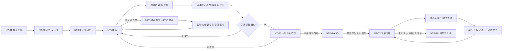

# NeuroTruth 앱 디자인·워크플로우 인계 v9

이 문서는 환자용 Android 앱의 화면 구조와 상호작용을 프런트엔드 개발자에게 전달한다. 함께 제공되는 `docs/handoff/neurotruth_app_design_handoff_v9.pptx`의 화면 번호와 파이프라인 번호를 기준으로 한다.

### 현재 구현·검증 상태 (2026-07-17)

- 로컬 Docker에서 Alembic `0005` head 적용을 확인했다.
- backend `/health`, `/ready`와 web 응답이 모두 `200`인 것을 확인했다.
- 20초 모델의 CPU smoke test에서 1,024점 입력과 artifact SHA 검증을 통과했다.
- STT 비활성 설정에서 상태 API와 서비스 health 동작을 확인했다.
- DGX의 Whisper CUDA, FactorizePhys, 새 갈망 모델 CUDA와 실제 휴대폰 음성·카메라 흐름은 배포 환경에서 별도 인수 검증한다.

## 1. 제품 표현 원칙

- NeuroTruth는 갈망 상황에서 기록과 대화 지원을 제공하는 연구용 보조 시스템이다.
- 환자 화면에서 모델의 class-1 확률 원값이나 정확한 퍼센트를 노출하지 않는다.
- 갈망 상태 문구는 임상 위험도, 진단, 치료 효과 또는 확정 판정으로 표현하지 않는다.
- 챗봇은 텍스트 입력과 음성 입력을 동등하게 처리한다. AI 응답 텍스트는 항상 보이고 TTS는 선택 기능이다.
- 하단 탭은 `홈 · 대시보드 · 챗봇` 세 개만 사용한다.
- 프로필·동의·권한·로그아웃은 홈 우측 상단의 설정 버튼에서 연다.

## 2. 화면 이름

| ID | 화면 | 핵심 역할 |
| --- | --- | --- |
| `NT-01` | 제품 안내 | 사용 대상, 한계, 연구용 보조 시스템 안내 |
| `NT-02` | 가입·로그인 | 환자 직접 가입과 기존 계정 로그인 |
| `NT-03` | 동의·권한 | 필수/선택 동의, 음성·카메라 선택, 사용 시점 권한 요청 |
| `NT-04` | 홈 | 프로필, 갈망 상태 문구, Watch 상태, 얼굴 측정 진입 |
| `NT-05` | 갈망 알림 | 스마트폰 팝업으로 `지금 대화하기` 또는 `나중에` 선택 |
| `NT-06` | AUQ | 현재 8개 한국어 adaptation 문항과 7개 문장형 선택지 |
| `NT-07` | AI 챗봇 | 텍스트·STT 입력, 자유대화, AI 텍스트·TTS, 재시도·종료 |
| `NT-08` | 대시보드 | 갈망 상태, 갈망 이벤트, AUQ 기록을 시간·일 막대로 탐색 |
| `NT-09` | 설정 | 계정, 동의, 권한, 제품 안내, 로그아웃 |

## 3. 전체 사용자 흐름



## 4. 정보 구조

### 홈 탭 — `NT-04`

홈은 한 화면에서 다음 세 카드와 설정 버튼만 먼저 보여 준다.

1. **프로필 카드**
   - 사용자 이름과 최소 기본 정보만 표시한다.
   - 우측 상단 설정 버튼은 `NT-09`를 연다.
2. **갈망 상태 카드**
   - 확률 원값 대신 네 구간 문구를 표시한다.
   - 최신 알림이 있으면 상태 문구와 별도로 `대화 권장`을 표시한다.
   - 보조 버튼 `얼굴로 측정`은 20초 rPPG 측정 흐름을 연다.
3. **Watch 카드**
   - `연결됨`, `연결 필요`, `데이터 수집 중`처럼 연결·수집 상태만 표시한다.
   - 실시간 PPG 그래프는 홈에 넣지 않는다.

### 대시보드 탭 — `NT-08`

- 삼성헬스의 일일 활동 화면처럼 큰 요약, 날짜 선택, 시간·일 막대, 선택 상세 순서로 아래로 스크롤한다.
- 갈망 상태, 갈망 이벤트, AUQ 기록은 서로 다른 섹션으로 분리한다.
- 막대를 누르면 선택한 시간/날짜와 상태 문구 또는 원점수·건수를 표시한다.
- 데이터가 없는 구간은 회색 공백으로 두고, 유효한 이벤트 `0건`은 `0건`으로 표시한다.

### 챗봇 탭 — `NT-07`

- 진행 중 세션이 있으면 이어서 열고, 없으면 중립 안내로 새 자유대화를 시작한다.
- 입력 바는 `마이크 · 텍스트 입력 · 전송`으로 구성한다.
- AI 말풍선에는 `듣기/정지`를 제공한다.
- 화면 상단의 종료 버튼은 확인 후 세션을 마감한다.

## 5. 갈망 상태 표시

| class-1 확률 원값 | 환자 화면 문구 |
| --- | --- |
| `0 ≤ p < 0.25` | 낮은 가능성 |
| `0.25 ≤ p < 0.50` | 변화 관찰 |
| `0.50 ≤ p < 0.75` | 주의 필요 |
| `0.75 ≤ p ≤ 1.00` | 높은 가능성 |

- 확률 원값은 백엔드·DB 계약을 위해 유지한다.
- 홈, 대시보드, 막대 선택 상세에서는 정확한 퍼센트를 숨긴다.
- 위 구간은 연구 UI 표시 규칙이며 임상적 cutoff가 아니다.

## 6. Watch 센서 흐름

```text
Watch 연결
→ 첫 20초 warm-up
→ PPG/GSR 최근 20초 창 구성
→ 10초마다 최신 20초 창 전송
→ 백엔드 1,024점/채널 전처리·추론
→ binary class, class-1 확률, alertAction 수신
→ 홈 상태 문구·알림·대시보드 갱신
```

프런트엔드 계약:

- `windowMs = 20000`
- 첫 추론 전 20초를 모은다.
- 이후 10초 간격으로 최신 20초 창을 보낸다.
- 데이터가 끊긴 시간은 추정값으로 채우지 않고 대시보드에서 공백으로 남긴다.
- 서버의 `alertAction`만 사용하며 앱이나 Watch에서 class 값만으로 별도 알림을 만들지 않는다.

## 7. 얼굴 영상·rPPG 흐름

홈 갈망 카드의 `얼굴로 측정`을 누르면 다음 상태를 순서대로 표시한다.

```text
얼굴 찾기 → 1초 안정화 → 20초 촬영
→ 업로드 → 분석 대기 → 결과 또는 재촬영/실패
```

- 촬영 중 얼굴이 1초 이상 사라지거나 앱이 background로 이동하면 취소한다.
- 20초 영상이 접수되면 로컬 임시 영상을 삭제하고 job polling을 이어 간다.
- 완료 결과는 정확한 퍼센트가 아니라 네 구간 문구로 홈에 표시한다.
- 결과는 `source=camera_rppg`로 기존 기록 흐름에 반영한다.

사용 API:

| 동작 | API |
| --- | --- |
| 기능 상태 | `GET /api/rppg/status` |
| 20초 영상 접수 | `POST /api/rppg/jobs` |
| 분석 상태 polling | `GET /api/rppg/jobs/{jobId}` |
| 수동 재분석 | `POST /api/rppg/jobs/{jobId}/retry` |

## 8. 갈망 알림과 AUQ

### 알림 — `NT-05`

- 스마트폰 팝업 형태로 표시한다.
- 기본 버튼은 `지금 대화하기`, 보조 버튼은 `나중에`다.
- `나중에`는 팝업만 닫고 현재 화면을 유지한다.
- 알림 문구는 갈망을 확정하거나 진단하는 방식으로 쓰지 않는다.

### AUQ — `NT-06`

현재 8개 한국어 adaptation 문항을 유지하고 각 문항의 선택지는 다음 순서로 고정한다.

| 값 | 표시 문구 |
| ---: | --- |
| 1 | 매우 그렇지 않다 |
| 2 | 그렇지 않다 |
| 3 | 조금 그렇지 않다 |
| 4 | 보통이다 |
| 5 | 조금 그렇다 |
| 6 | 그렇다 |
| 7 | 매우 그렇다 |

- `다음`은 선택한 값을 저장하고 다음 문항을 보여 준다.
- `건너뛰고 대화하기`는 AUQ 미완료 상태를 저장하고 `NT-07`을 연다.
- 총점은 `8~56` 원점수로 저장·표시한다.
- 대시보드 선택 상세는 `총점 X/56`으로 표시한다.
- 임의의 낮음/중간/높음 구간을 만들지 않는다.
- 설명 문구는 `점수가 높을수록 당시 음주 욕구 관련 응답이 높았습니다`만 사용한다.

## 9. 챗봇 STT·TTS

### 텍스트·STT 입력

1. 텍스트 입력은 언제든 사용할 수 있다.
2. 마이크를 탭하면 녹음을 시작하고 다시 탭하면 종료한다.
3. 녹음은 최대 30초다.
4. STT 결과는 편집 가능한 입력창에 채운다.
5. 자동 전송하지 않는다. 사용자가 최종 문장을 확인하고 전송 버튼을 눌러야 한다.
6. STT 실패 시 입력창과 키보드 입력을 유지한다.
7. 최종 전송 텍스트만 대화 메시지로 저장한다.

사용 API:

| 동작 | API/계약 |
| --- | --- |
| STT 준비 상태 | `GET /api/stt/status` |
| 한국어 음성 인식 | `POST /api/sessions/{sessionId}/transcriptions` |
| 자유대화 메시지 | `POST /api/sessions/{sessionId}/messages` |
| 메시지 입력 방식 | `inputModality = text | voice` |

### AI 텍스트·TTS 응답

- AI 텍스트는 항상 말풍선에 표시한다.
- 말풍선별 `듣기/정지`를 제공한다.
- 자동 읽기 토글은 기본 `OFF`다.
- 다른 말풍선을 재생하거나 화면을 벗어나면 기존 발화를 중지한다.
- TTS 실패는 텍스트 응답과 메시지 저장을 막지 않는다.

### 자유대화 규칙

- 고정 문진이나 질문 순서를 표시하지 않는다.
- 공감·반영·실질적인 도움을 우선한다.
- 질문은 필요할 때만 한 응답에 최대 하나 사용한다.
- 이미 답했거나 거부한 내용을 다시 묻지 않는다.
- 진단, 처방, 치료 효과, 확정적 인과 표현을 사용하지 않는다.
- provider 실패 시 사용자 메시지를 중복 생성하지 않고 같은 메시지에 `응답 다시 받기`를 제공한다.

## 10. 대시보드 데이터 규칙

| 섹션 | 기본 표시 | 선택 상세 |
| --- | --- | --- |
| 갈망 상태 | 오늘 24개 시간 막대, 7일/30일 일 막대 | 선택 시간·날짜, 네 구간 문구, 표본 수 |
| 갈망 이벤트 | `recommend|required` 알림 발생 건수 | 선택 날짜와 이벤트 건수 |
| AUQ | 오늘 시간별 또는 7일/30일 일별 원점수 막대 | `총점 X/56`, 응답 횟수 |

- 갈망 상태 막대도 정확한 퍼센트를 텍스트로 표시하지 않는다.
- AUQ를 0~100%로 정규화하지 않는다. 축 최대값은 56이다.
- 데이터 없음과 유효한 0건을 시각적으로 구분한다.

## 11. 탭·버튼 반응 매핑

| 현재 화면 | 누르는 항목 | 앱 반응 | 이동·유지 화면 |
| --- | --- | --- | --- |
| `NT-01` | 확인하고 계속 | 안내 확인 상태 저장 | `NT-02` |
| `NT-02` | 가입하고 시작 / 로그인 | 계정 처리 후 동의 상태 확인 | `NT-03` 또는 `NT-04` |
| `NT-03` | 동의 저장 | 선택 동의·권한 상태 저장 | `NT-04` |
| `NT-04` | Watch 연결 | 20초 warm-up 후 10초 cadence 시작 | `NT-04` 유지 |
| `NT-04` | 얼굴로 측정 | 20초 촬영·업로드·job polling | `NT-04`, 기록은 `NT-08` 반영 |
| `NT-05` | 지금 대화하기 | 대화 진입 상태 저장 | `NT-06` |
| `NT-05` | 나중에 | 팝업 닫기 | 현재 화면 유지 |
| `NT-06` | 7단계 문장 / 다음 | 값 저장 후 다음 문항 표시 | `NT-06` 유지 |
| `NT-06` | 건너뛰기 / 마지막 완료 | AUQ 상태 저장 후 대화 열기 | `NT-07` |
| `NT-07` | 마이크 시작 / 정지 | STT 결과를 편집 가능한 입력창에 채움 | `NT-07` 유지 |
| `NT-07` | 전송 | 최종 문장 저장 후 AI 응답 요청 | `NT-07` 유지 |
| `NT-07` | 듣기 / 정지 | Android TTS 재생 상태 변경 | `NT-07` 유지 |
| `NT-07` | 종료 | 대화 마감·기록 반영 | `NT-08` |
| `NT-08` | 막대 선택 | 상태 문구, AUQ X/56 또는 이벤트 건수 표시 | `NT-08` 유지 |

## 12. 화면 상태 체크리스트

### 공통

- [ ] 기본, 로딩, 빈 데이터, 오류, 재시도, 비활성 상태가 정의되어 있다.
- [ ] 색상만으로 상태를 구분하지 않고 텍스트 라벨을 함께 제공한다.
- [ ] 실제 환자 정보·API 키·토큰·서버 내부 정보가 디자인 자산에 없다.
- [ ] 정확한 갈망 퍼센트, 진단·치료·인과 표현이 환자 화면에 없다.

### 홈·센서

- [ ] Watch 연결 전/연결 중/연결됨/수집 중 상태가 구분된다.
- [ ] 20초 warm-up 동안 결과 대신 수집 진행 상태가 보인다.
- [ ] 얼굴 측정의 촬영·업로드·분석·완료·재촬영 상태가 보인다.

### AUQ·챗봇

- [ ] 7개 문장형 선택지와 값 `1~7` 매핑이 일치한다.
- [ ] STT 결과가 자동 전송되지 않는다.
- [ ] STT 실패 후 텍스트 입력을 계속 사용할 수 있다.
- [ ] TTS 재생 중 화면 이탈 시 음성이 중지된다.
- [ ] 재시도 시 사용자 말풍선이 중복 생성되지 않는다.

### 대시보드

- [ ] 갈망 상태를 네 구간 문구로만 설명한다.
- [ ] AUQ 축은 `8~56`, 선택 상세는 `X/56`이다.
- [ ] 데이터 없음과 유효한 이벤트 `0건`이 구분된다.

## 13. PPT 슬라이드 매핑

| 슬라이드 | 내용 |
| ---: | --- |
| 1 | v9 전체 사용자 흐름과 3탭 |
| 2 | 안내·가입·동의와 사용 시점 권한 |
| 3 | 홈 카드, Watch 상태, 20초 얼굴 측정 |
| 4 | 갈망 알림, AUQ 7문장, 자유대화 진입 |
| 5 | 텍스트·STT 입력, TTS, 재시도·종료 |
| 6 | 갈망 상태·이벤트·AUQ 대시보드 |
| 7 | 파이프라인 1: 시작부터 20초 측정 |
| 8 | 파이프라인 2: 알림·AUQ·대화 |
| 9 | 파이프라인 3: 음성 대화와 기록 |

관리자 웹, Wear OS 상세 화면, 내부 서버 구성과 보안 운영 절차는 이 모바일 디자인 인계 범위에 포함하지 않는다.
